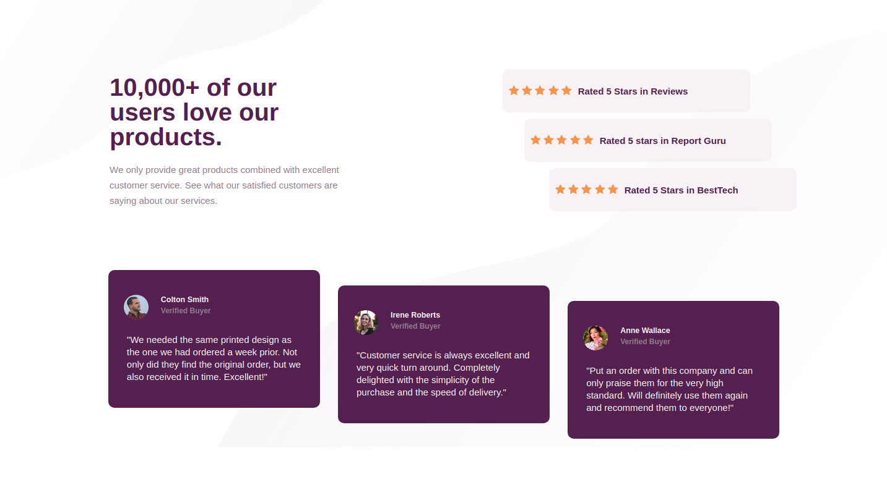

# Frontend Mentor - Social proof section solution

This is a solution to the [Social proof section challenge on Frontend Mentor](https://www.frontendmentor.io/challenges/social-proof-section-6e0qTv_bA). Frontend Mentor challenges help you improve your coding skills by building realistic projects. 

## Table of contents

- [Overview](#overview)
  - [The challenge](#the-challenge)
  - [Screenshot](#screenshot)
  - [Links](#links)
- [My process](#my-process)
  - [Built with](#built-with)
- [Author](#author)
- [Acknowledgments](#acknowledgments)

## Overview
Building a social proof page using HTML and CSS

### The challenge

Users should be able to:

- View the optimal layout for the section depending on their device's screen size

### Screenshot

### Links

- Solution URL: 
- Live Site URL: 

## My process
I designed this mobile-first. Laid out the HTML, added base styles to CSS and then added media queries and related styles for respective mobile and laptop screens.

### Built with

- Semantic HTML5 markup
- CSS custom properties
- Flexbox
- Mobile-first workflow

### What I learned

Structuring the sections properly in the DOM to style them accordingly was important. 

## Author

- Website - rhu - https://github.com/rhulog
- Twitter - @rhuminations - https://twitter.com/rhuminations

## Acknowledgments

I want to thank FrontEnd Mentors for creating this challenge. It's managed to be concise enough that I blazed through it but insightful enough that I learnt something new while I was at it.
